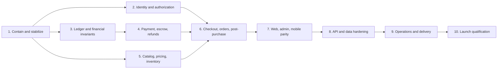

# AgroTraders Ten-Phase Remediation Plan

**Source:** `AUDIT_REPORT.md` (767 lines)  
**Scope:** API, PostgreSQL schema, web, admin, Expo mobile, Docker/nginx, CI/CD, operational controls  
**Plan status:** Proposed execution plan; no remediation code is represented as complete  
**Launch status:** Blocked until the Phase 10 go/no-go gate passes

## 1. What “ten phases” means

The phases are dependency and release gates, not ten individual fixes. This plan covers:

- all 50 confirmed findings in the audit (6 Critical, 31 High, and 13 Medium);
- every partial, broken, or missing ecommerce-baseline capability;
- all 10 requested end-to-end flows;
- the full 333-endpoint inventory as an API-hardening control register;
- all 14 manual-verification items; and
- the dead, misleading, or unreachable surfaces called out in discovery.

A phase is complete only when its code, migrations, automated tests, operational controls, rollback procedure, and evidence have all passed. Closing a ticket or merging code is not an exit condition.

Features such as phone/social login, COD, SMS/WhatsApp, and external carriers require a product decision. They may be marked `N/A` only through written product/security sign-off in Phase 1; silence does not remove them from scope.

## 2. Program-wide rules

1. Keep real-money operations, mock top-up, generic paid-state changes, and unsafe settlement disabled until their specific gates pass.
2. Use integer minor units plus an ISO currency for money. Never use display strings or binary floating point as an accounting value.
3. Every financial or inventory mutation must have an idempotency key, a database transaction, an auditable state transition, and a concurrency test.
4. Clients submit intent and references; the server resolves products, prices, discounts, tax, shipping, stock, permissions, and final totals.
5. State machines use explicit allowed transitions and conditional database writes. Generic status patch endpoints are prohibited.
6. Schema releases use expand → backfill → verify → switch reads/writes → contract. Destructive contraction occurs only after rollback windows expire.
7. Web and mobile compatibility is preserved during rolling releases. Contract changes are additive or versioned until the minimum supported client advances.
8. Logs must never contain credentials, OTPs, access/refresh/download tokens, payment payload secrets, or unnecessary personal data.
9. A failed external notification, analytics call, or translation cannot roll back a committed order or payment. Such work goes through durable jobs/outbox records.
10. Every finding closure links to a test or an operational evidence artifact. Manual statements such as “works on my machine” are insufficient.
11. Completing a domain phase does not authorize public traffic. All new checkout and financial writes remain feature-flagged until Phase 10.

### Mandatory schema-change sequence

Every schema-bearing work package follows the same release protocol:

1. expand with nullable/additive structures and backward-compatible APIs;
2. deploy compatible code before changing the source of truth;
3. backfill in bounded, resumable batches with row counts, checksums, exception records, and production-like timing;
4. dual-read/write only where unavoidable and for a named, time-bounded window;
5. validate constraints and create large indexes with the safest supported PostgreSQL procedure;
6. cut over reads/writes behind an independently reversible feature flag;
7. observe reconciliation, latency, locks, errors, and old-client behavior through the rollback window; and
8. contract old columns/routes only in a later release after supported clients migrate.

No release deletes ledger, payment, reconciliation, audit, or source backfill evidence. Financial corrections use compensating entries. Every migration is rehearsed on a production-sized sanitized clone after a verified snapshot/restore test.

## 3. Dependency order and ownership

Phases 2, 3, and 5 can run in parallel after Phase 1, but their contracts must be jointly reviewed before migration work begins. Phase 8 is the endpoint-by-endpoint closure sweep; its validation, ownership, bounds, and idempotency standards apply while Phases 2–7 are being built, not only afterward.

| Phase | Accountable roles | Relative size | Principal dependency |
|---|---|---:|---|
| 1 | Tech lead, security, DevOps, QA | M | None |
| 2 | Backend auth, web, mobile, security | XL | Phase 1 |
| 3 | Backend finance, database, security | XL | Phase 1 |
| 4 | Backend finance, provider specialist, QA | XL | Phase 3 |
| 5 | Backend catalog, database, admin | XL | Phase 1 |
| 6 | Commerce backend, web, mobile, QA | XXL | Phases 2, 4, 5 |
| 7 | Web, mobile, admin, accessibility, product | XXL | Phase 6 stable APIs |
| 8 | API, database, security, performance | L | Phases 2–7 implemented behind flags |
| 9 | DevOps/SRE, backend workers, security, QA | XL | Phase 8; stable domain workflows |
| 10 | QA lead, security, finance, operations, product | L | All prior phases |

Calendar estimates require team size, provider lead times, compliance requirements, and launch scope. Relative sizes are used here to avoid a false schedule.

## 4. Phase 1 — Emergency containment and reproducible baseline

### Objective

Prevent known loss/security paths from being exposed while making the repository and release pipeline trustworthy enough for subsequent work.

### Work packages

1. **Financial kill switches (S)**
   - Remove the mock wallet top-up route from production registration or return a hard failure outside an explicit test environment.
   - Reject buyer/client requests that attempt to set `paid`, `escrow_held`, refunded, payout-approved, or dispute-settled states.
   - Temporarily disable dispute payout and manual balance adjustment operations that can create unbacked funds.
   - Add startup assertions and telemetry showing these controls are disabled in every non-test environment.
   - Remove the transaction-capable mock-product fallback immediately: a failed or changing product request must clear selection and disable ordering.
   - Remove production KYC/admin/homepage/demo-data fallbacks that can impersonate live data or privileged identities.
2. **Production configuration repair (S)**
   - Make web/admin builds consume one documented public API-origin variable and fail the build when it is missing or points to localhost in production.
   - Remove guessable Compose credential fallbacks; require distinct DB, Redis, MinIO, JWT, SMTP, Firebase, and third-party values as applicable.
   - Make demo data/accounts an explicit non-production seed profile. Add a production startup/deploy check that rejects known demo emails/password hashes.
3. **Build-context containment (S)**
   - Deny backups, logs, database dumps, archives, generated artifacts, secrets, and local credentials in `.dockerignore`.
   - Rebuild without cache and inspect image layers/build context. Purge affected remote builder caches if sensitive material ever reached them.
4. **Restore the engineering baseline (M)**
   - Fix the two failing API tests and the mobile lint errors without weakening assertions.
   - Capture clean results for typecheck, lint, unit tests, production builds, Prisma validation, and Compose rendering.
   - Resolve the local CA/proxy trust issue or run the dependency audit in a trusted CI environment.
5. **Scope decisions and registers (S)**
   - Decide implement vs signed `N/A` for phone login, social login, COD, SMS, WhatsApp, external shipping, typo-tolerant search, and regulated deletion/export requirements.
   - Assign an owner and tracking ticket to every `F`, `E2E`, and `V` ID and every named row in the feature-gap and dead-surface ledgers.
   - Record production migration status and take a recoverable pre-remediation database/file snapshot.

### Tests and evidence

- Production-config unit tests prove missing values and localhost origins fail closed.
- Route tests prove disabled financial mutations cannot execute in production mode.
- A secret scan and image-layer inspection show no backup/log/secret payloads.
- `pnpm typecheck`, `pnpm lint`, `pnpm test`, `pnpm build`, Prisma validation, Compose config, and a trusted dependency audit are green or have an approved, time-bounded exception.

### Rollback

Configuration fixes and route kill switches remain independently reversible, but rolling back must never re-enable unsafe financial endpoints. Preserve the pre-change images and schema snapshot.

### Exit gate

No known money-minting/status-only payment route is usable; no mock or demo fallback can mutate live state; production clients cannot compile against localhost; required configuration has no weak fallback; no sensitive artifact enters a Docker context; the baseline CI checks are reproducibly green.

## 5. Phase 2 — Identity, sessions, authorization, and account lifecycle

### Objective

Make every HTTP, WebSocket, download, admin, web, and mobile identity decision use explicit token purpose, revocable sessions, and consistent role enforcement.

### Work packages

1. **Token-purpose separation (M)**
   - Give access, refresh, password-reset, email-verification, invoice/KYC/statement download, and dispatch OTP tokens distinct type/audience claims and preferably distinct keys.
   - The access strategy must accept only `typ=access`; download routes use a separate verifier with narrow resource/user scope and single-purpose lifetime.
2. **Revocable session families (L)**
   - Add persisted session/refresh-family records containing hashed token IDs, device metadata, rotation lineage, expiry, revocation reason, and last use.
   - Rotate refresh tokens on every use; detect replay and revoke the family.
   - Password reset, account disable/delete, logout, and logout-all revoke the appropriate sessions.
3. **Safe client storage and CSRF (L)**
   - Move web/admin refresh credentials to `Secure`, `HttpOnly`, `SameSite` cookies. Keep short-lived access tokens in memory or adopt a fully cookie-based session with CSRF protection.
   - Keep native secrets in SecureStore and clear both token and user state atomically on terminal refresh failure.
   - Unregister the mobile push token while authenticated, then revoke/clear the session; make repeated logout safe.
4. **RBAC and active role (L)**
   - Apply the same JWT, account-status, role, and scoped-permission guard to WebSockets as HTTP.
   - Prevent `users_manage` from granting/removing the root `admin` role; reserve that action for an explicit super-admin capability plus step-up authentication and audit.
   - Persist/select active role in each client and send it consistently on role-sensitive calls; test multi-role users.
5. **OTP and one-shot token hardening (L)**
   - Replace dispatch `Math.random` OTPs with cryptographic six-digit or stronger values, hashed at rest, with expiry, attempts, resend cooldown, and consumption timestamp.
   - Rate-limit login/reset/verification OTPs per account/recipient and IP, with abuse monitoring and privacy-safe responses.
   - Consume all one-shot tokens using a conditional update/transaction so simultaneous requests have one winner.
6. **Account lifecycle completion (M)**
   - Finish mobile password reset, verification delivery/error behavior, account export/deletion or a documented legal retention flow, session/device management, and logout-all UI/API.
   - Implement phone/social authentication only if Phase 1 places them in scope; otherwise record approved `N/A` rationale.
7. **Origin and transport policy (M)**
   - Fail closed on missing production CORS allowlists and share the resolved policy with WebSocket gateways.
   - Disable Android cleartext traffic in release manifests/network-security config; explicitly whitelist only development endpoints in debug builds.

### Data and migration

Add sessions/refresh families, hashed one-shot tokens with expiry/attempt/consumption fields, device-session linkage, and security audit events. Backfill is not required for stateless refresh tokens: deploy the new verifier and intentionally expire all old refresh tokens at the cutover.

### Tests

- Unit: token-type rejection, rotation, replay detection, OTP expiry/attempt/cooldown, role-grant policy.
- Integration: logout one/all, password-reset revocation, concurrent one-shot consumption, disabled/deleted account, WebSocket permission matrix, multi-role selection.
- Client: terminal refresh clears UI state; push unregister ordering; cookie/CSRF behavior; mobile cold restart after revocation.
- Security: token substitution, refresh replay, ID enumeration, origin bypass, brute-force limits, admin privilege escalation.

### Rollback

Run old access tokens only for a short dual-read window if necessary; never allow download tokens through the access strategy. Session schema is additive. Client cookie changes require backward-compatible refresh endpoints until the minimum supported versions advance.

### Exit gate

No cross-purpose token works as an access token; all sessions are revocable and rotate; logout-all works; WebSocket and HTTP authorization match; admin escalation is separately protected; OTP and one-shot races pass security/concurrency tests; web/mobile auth-failure states are correct.

## 6. Phase 3 — Immutable ledger and financial invariants

### Objective

Replace mutable/unbacked balance behavior with a source-of-truth double-entry ledger that cannot create value through retries or races.

### Work packages

1. **Financial domain model (XL)**
   - Define ledger accounts, balanced journal transactions, debit/credit entries, holds, releases, captures, transfers, fees, adjustments, payouts, disputes, refunds, reversals, and reconciliation references.
   - Store integer minor units, currency, immutable timestamps, initiator, reason code, correlation ID, and idempotency key.
   - Enforce balanced journals and nonnegative spendable balance with database constraints/transaction isolation rather than read-then-write application checks.
2. **Wallet conversion (L)**
   - Make displayed wallet balance a ledger projection or transactionally maintained cache that can be rebuilt.
   - Replace direct balance increments/decrements and unrestricted admin adjustments with typed journal operations and four-eyes approval for sensitive adjustments.
3. **Payout and settlement claims (L)**
   - Claim payout/dispute/hire settlement exactly once using conditional state transitions plus unique idempotency constraints.
   - Prevent a second worker/admin request from executing the financial side effect.
4. **Historical data treatment (M)**
   - Inventory existing balances, mock top-ups, adjustments, disputes, and payouts.
   - Quarantine or reconcile unsupported balances rather than inventing opening funds. Finance/product must approve documented opening entries.
   - Produce a before/after reconciliation report and preserve immutable source extracts.
5. **Service boundary (M)**
   - Expose narrow commands such as `authorize`, `hold`, `capture`, `release`, `refund`, and `payout`; prohibit arbitrary balance/status writes from controllers and admin modules.

### Tests

- Property tests: every journal balances; no operation creates/destroys money except approved source/sink accounts.
- Concurrency: simultaneous debit, withdrawal, payout decision, duplicate dispute settlement, and worker retry.
- Recovery: transaction rollback, deadlock retry, idempotent replay, projection rebuild, and reconciliation mismatch alert.
- Authorization: finance permissions, step-up controls, dual approval, and immutable audit record.

### Rollback

Use shadow ledger writes and reconciliation before switching reads. Do not dual-write indefinitely. A rollback returns reads to the old projection but leaves immutable shadow entries intact for investigation; no reverse migration deletes journals.

### Exit gate

All financial mutations go through balanced immutable journals, every command is idempotent, concurrent tests show no overdraft or double settlement, historical balances reconcile, and administrators cannot directly mint funds.

## 7. Phase 4 — Payment, escrow, refund, and reconciliation platform

### Objective

Introduce real provider- or wallet-backed payment semantics and remove the status-only fiction currently labeled payment/escrow.

### Work packages

1. **Provider and compliance selection (M)**
   - Select a gateway/escrow-compatible model based on supported countries, marketplace split/settlement rules, KYC, refunds, fees, currencies, and webhook guarantees.
   - Document whether AgroTraders legally holds funds or uses provider-managed marketplace balances.
2. **Payment records and adapter (XL)**
   - Add PaymentIntent, PaymentAttempt, ProviderEvent, Escrow/Hold, Refund, Settlement, and Reconciliation entities linked to checkout/order/ledger IDs.
   - Keep provider code behind an adapter; persist request/response identifiers and normalized states, not secrets.
3. **Trusted amount and idempotency (L)**
   - Build provider requests only from the server-signed checkout snapshot.
   - Use distinct idempotency keys for intent creation, capture, refund, and settlement, with unique constraints and deterministic replay responses.
4. **Webhook pipeline (XL)**
   - Verify signatures against raw bytes and timestamp tolerance before parsing/processing.
   - Persist event IDs before side effects, handle duplicate/out-of-order delivery, acknowledge quickly, and process through a durable worker.
   - Model redirect-before-webhook and webhook-before-redirect explicitly; provider state wins after verification.
5. **Failure, expiry, and retry (L)**
   - Represent initiated, pending, authorized, captured, failed, expired, cancelled, partially refunded, refunded, disputed, and reconciliation-needed states.
   - Release reservations/holds only through idempotent compensating transitions.
6. **Refunds and disputes (L)**
   - Tie cancellations/returns/dispute decisions to provider refund plus ledger reversal, with pending/failed/manual-review states.
   - Do not tell the customer “refunded” until the provider/ledger outcome supports it.
7. **Top-up/COD decision (M)**
   - Replace mock top-up with a verified provider funding flow or remove it.
   - If COD is in scope, create a separate collection/reconciliation state machine; COD must never reuse online-paid states.
8. **Reconciliation/admin tooling (M)**
   - Provide permissioned searches by order/payment/provider ID, unmatched-event queues, settlement reports, retry controls, and fully audited manual interventions.

### Tests

- Contract tests against provider sandbox fixtures, including signature failure and schema drift.
- Integration tests for duplicate/reordered webhooks, timeout after provider success, redirect races, partial/full refund, retry, charge dispute, and reconciliation mismatch.
- Concurrency tests prove one capture/refund/settlement per idempotency key.
- Fault injection proves notification/provider timeouts do not corrupt order or ledger state.

### Rollback

Deploy schema and event ingestion before enabling payment creation. Provider callbacks remain routable during rollback. Feature flags can stop new intents while workers finish or quarantine existing events. Never roll back by deleting provider/ledger records.

### Exit gate

No order becomes paid or escrow-held without verified funding; amount tampering fails; webhooks are signed, durable, idempotent, and order-independent; refunds/settlements reconcile to the ledger and provider; kill switches stop new money movement safely.

## 8. Phase 5 — Catalog, canonical pricing, variants, and inventory

### Objective

Create one authoritative sellable-offer model so the server can price, reserve, and fulfill the exact SKU/unit a buyer selected.

### Work packages

1. **Product/offer/variant model (XL)**
   - Define product content separately from sellable offer/SKU, variant attributes, seller, unit of measure, quantity precision, price, MRP, discount evidence, currency, availability window, moderation state, and fulfillment location.
   - Snapshot SKU, unit, price components, seller, tax category, and descriptive data into quote/order lines.
2. **Canonical money and quantity rules (L)**
   - Accept typed integer minor units or validated decimal strings converted once server-side.
   - Define per-unit quantity scale (for kg/MT/etc.), MOQ, increment, maximum, conversions, display rounding, and invoice precision.
   - Reject negative/malformed amounts and impossible MRP/discount combinations.
3. **Inventory and reservation (XL)**
   - Add on-hand, reserved, available, damaged/blocked, warehouse/location, inventory movements, reservation expiry, and reason/source.
   - Reserve with an atomic conditional update/row lock; capture on the chosen order/payment milestone; release on failure, cancellation, expiry, and approved return where applicable.
   - Prevent negative available stock and duplicate release/capture.
4. **Listing eligibility (M)**
   - Centralize a sellable predicate covering moderation, owner/account state, publish/expiry dates, stock, and variant status.
   - Use it on list, search, detail, related, quote, cart validation, and checkout—not only catalog lists.
5. **Discovery completion (M)**
   - Add cursor pagination to mobile, recently viewed, deterministic related recommendations, and a documented typo-tolerance strategy or signed `N/A` decision.
   - Preserve explicit API error vs empty-result states for clients.
6. **Admin catalog/inventory APIs (L)**
   - Add variant/SKU CRUD, stock movements/adjustments with reasons, inventory history, bulk import validation/preview/idempotency, and low-stock/blocked views.
   - Extend media/gallery handling without trusting client-declared object size.
7. **Reviews correctness (M)**
   - Correct product-vs-seller aggregation boundaries; add public pagination and author delete with audit/tombstone behavior.

### Data and migration

Add offer/SKU, attributes, inventory location/balance/movement/reservation, price/version, and order-line snapshot tables. Backfill each current listing into a default SKU only after validating unit/price data; quarantine invalid listings rather than inventing values.

### Tests

- Unit/property: money conversion, quantity increments, MOQ/max, free-shipping/coupon boundary inputs needed by Phase 6, review aggregation.
- Integration: moderation/expiry direct lookup, two buyers/last unit, reservation expiry, price change, variant disable, duplicate release/capture, bulk import replay.
- Migration: default-SKU backfill counts and reconciliation of inventory movement totals.

### Rollback

Dual-read old product fields and new default SKUs during a bounded compatibility window. Inventory mutations begin only after all write paths use movements/reservations. Never contract legacy columns until old clients are retired and reconciliation is clean.

### Exit gate

Every orderable item resolves to a valid SKU with canonical unit/price and enforceable stock; non-live listings cannot be bought by ID; oversell/negative stock tests pass; admin can safely manage variants/inventory; catalog discovery and review gaps have verified behavior.

## 9. Phase 6 — Cart, checkout, orders, fulfillment, and post-purchase

### Objective

Build the missing server-authoritative commerce flow and explicit order lifecycle on top of identity, payment, pricing, and inventory foundations.

### Work packages

1. **Address book (M)**
   - Add owner-scoped multiple addresses, default address, validation, normalization, soft deletion, and immutable order-address snapshots.
   - Recheck ownership and serviceability at checkout.
2. **Account and guest cart (L)**
   - Add server cart/lines with SKU, requested quantity, version, timestamps, and validation results.
   - Use an opaque guest-cart identity; merge deterministically on signup/login without duplicating quantities or exceeding limits.
   - Reprice/revalidate after every mutation and before checkout. Flag removed, expired, price-changed, MOQ, and out-of-stock lines.
3. **Real wishlist (M)**
   - Add owner-scoped wishlist add/remove/move-to-cart. Remove or rename the misleading Safe Deal “Saved” surface.
4. **Shipping, tax, and promotions (XL)**
   - Define delivery choices/serviceability, shipping fee and free-threshold boundaries, tax categories/inclusive-vs-exclusive rules, and coupon lifecycle.
   - Enforce coupon expiry, active window, applicable SKUs/categories/users, minimum spend, stacking, global/per-user usage, reservation, redemption, cancellation, and partial-refund allocation transactionally.
5. **Signed checkout snapshot (XL)**
   - Create a versioned CheckoutSession containing server-resolved lines, address, delivery option, subtotal, tax, shipping, discounts, grand total, currency, expiry, reservation IDs, and pricing-rule versions.
   - Require a client idempotency key; return the prior result for a replay and reject mismatched payload reuse.
6. **Order creation and state machines (XL)**
   - Replace short random references with collision-resistant IDs plus a unique constraint.
   - Create order/payment/inventory/coupon effects in one orchestrated transaction/saga with compensations.
   - Define distinct order, payment, fulfillment, cancellation, return, refund, dispute, RFQ, quote, trip, and dispatch transitions; remove generic state patching.
7. **Cancellation, return, replacement, and refund (XL)**
   - Encode who may request each action, allowed windows/statuses, reason/evidence, approval path, stock disposition, refund calculation, fees, and notifications.
   - Support partial-line cancellation/refund without violating promotion/tax allocations.
8. **RFQ and transport integrity (L)**
   - Accept quotes through a single conditional winner with unique constraints and idempotent side effects.
   - Separate negotiable RFQ prices from committed checkout/order totals and require reconfirmation after material price change.
9. **Invoice and confirmation (M)**
   - Generate invoices from immutable server order/payment/tax snapshots and platform/seller legal configuration; issuers cannot self-attest payment or arbitrary totals.
   - Add durable order confirmation records/events for buyer and seller.
10. **Tracking and notification events (M)**
    - Publish domain events for placed, payment pending/failed/captured, confirmed, dispatched, shipped, delivered, cancelled, returned, refund pending/processed/failed.
    - Include a versioned resource type/ID/deep-link target. Delivery becomes durable in Phase 9.
11. **External carrier decision (S/L)**
    - If in scope, implement carrier quotes/labels/tracking/webhooks behind an adapter. Otherwise keep internal logistics explicit and record signed `N/A` for external tracking.

### Tests

- Unit/property: `subtotal + shipping + tax - discount = total`, no negative total, rounding allocation, coupon minimum after removal, tax inclusive/exclusive, partial cancellation.
- Integration: guest merge, price change, last-unit checkout, idempotent double tap, expired quote/reservation, payment failure/retry, duplicate cancellation, quote acceptance race, invalid transitions.
- End-to-end API: all 10 audited flows at the service/API level, including close-before-webhook and two-device behavior.
- Authorization/IDOR: every order, address, cart, wishlist, return, refund, quote, and tracking resource.

### Rollback

Launch via versioned APIs and feature flags to internal accounts first. Keep legacy RFQ/direct-order reads but disable legacy unsafe writes. In-flight CheckoutSessions retain their pricing-rule version; stop new checkout creation before rolling back workers.

### Exit gate

The server owns all totals; checkout is idempotent; stock/coupon/payment/order effects remain consistent under retries; the complete cancellation/return/refund path works; invoices reflect trusted records; all revenue-flow integration tests pass.

## 10. Phase 7 — Web, admin, and mobile product parity

### Objective

Expose the safe domain flows consistently, remove misleading UI, and make failure/loading/offline/accessibility behavior explicit.

### Work packages

1. **Web commerce routes (XL)**
   - Implement real cart, wishlist, address, checkout, payment pending/return, confirmation, order detail/timeline, cancellation, return, dispute, and refund-status routes.
   - Remove the mock fallback product: a changing product ID must clear prior data and disable ordering until the exact request resolves.
   - Replace undefined `/console/*` and `/orders/:id` notification targets with canonical routes or compatibility redirects.
2. **Mobile commerce and navigation (XL)**
   - Replace/clearly separate the local RFQ basket from checkout cart; add server sync/merge, full catalog pagination, addresses, checkout, payment handoff/return, confirmation, cancellation/return/refund status.
   - Configure Expo/React Navigation linking for URL schemes, universal/app links, notification routes, and authenticated cold starts.
   - Handle Android back on checkout/payment, keyboards, safe areas, notification permissions, splash transition, and correct status bar per platform.
3. **Admin safety and completeness (L)**
   - Add variant, inventory, bulk catalog, coupon, refund/reconciliation, banner/CMS, and lifecycle management using the new permissioned APIs.
   - Route guards and navigation visibility are convenience only; the API remains authoritative. Require confirmation/reason/step-up for sensitive actions.
4. **Truthful marketplace presentation (M)**
   - Remove fabricated ratings, quality scores, review counts, buyer counts, and unsupported “protected payment” claims until backed by real data.
   - Label paid/promoted placements and record impression/click attribution. Define organic ranking separately.
5. **Loading, error, empty, and stale-data behavior (L)**
   - Distinguish request failure, no data, not found, unauthorized, offline, and retrying states on every list/detail/checkout/order surface.
   - Disable submissions while pending, use idempotency keys, invalidate the correct caches/badges after mutations, and show price/stock reconfirmation.
   - Add broken-image fallbacks and long-name/address overflow behavior.
6. **Offline and lifecycle recovery (L)**
   - Add NetInfo/AppState/focus reconnection, bounded query persistence, pull-to-refresh, and offline banners/retry without showing stale auth or false success.
7. **Accessibility and responsive quality (L)**
   - Fix shared dialog focus trap/return, accessible names for icon buttons, keyboard navigation, 44px touch targets, contrast, screen-reader announcements, large text, and motion preferences.
   - Test key web breakpoints, hydration/navigation/back behavior, and physical mobile safe-area/keyboard/back behavior.
8. **SEO and discoverability (L)**
   - Choose SSR/prerendering for public product/category content or document an equivalent crawlable architecture.
   - Add route-specific title/description/canonical/OG, Product/Breadcrumb JSON-LD, sitemap, robots, real 404/error pages, and stable image dimensions.
9. **Analytics, error tracking, and force update (M)**
   - Add consent-aware funnel events with stable names from browse → product → cart → checkout → payment → order, excluding sensitive fields.
   - Integrate error tracking/release versions/source maps and a minimum-version/force-update policy with a recoverable soft-update path.
10. **Reachability/dead-code cleanup (M)**
    - Decide and either connect or remove dead product-card carousel/cart controls, `/live`, unused `api-client.ts`, old nested product/admin screens, static home promos, and mismatched query invalidations.

### Tests

- Playwright: browse/cart/login merge/checkout/payment return/history; cancellation/refund; admin inventory/order/refund; token expiry; browser back; error/offline states; metadata/404.
- Expo device tests: Android/iOS cold/warm deep links, push taps, back, keyboard, safe area, poor network, pull-to-refresh, logout/revocation, large text/screen reader.
- Component/accessibility: automated axe-equivalent checks plus manual keyboard/screen-reader scripts.
- Visual/regression: key breakpoints, long data, missing images, loading transitions, price-change and out-of-stock modals.

### Rollback

Release clients behind capability flags returned by the API. Maintain old read routes until supported clients migrate; do not fall back to unsafe legacy writes. Mobile force-update must have an emergency bypass and store-review-aware rollout.

### Exit gate

Web and mobile complete the same safe buyer lifecycle; admin supports required operations without bypasses; no fabricated/undisclosed claims remain; deep links work cold and warm; error/offline/accessibility/SEO checks pass; dead surfaces are connected or removed.

## 11. Phase 8 — API validation, data-access, upload, and scalability hardening

### Objective

Apply a consistent security/performance contract to every endpoint in the audit inventory and every new endpoint introduced by remediation.

### Work packages

1. **Endpoint control register (L)**
   - Import the audit’s 333 routes into a maintained inventory with method/path, token purpose, auth/account guard, role/permission, resource ownership, request DTO, query limits, response schema, rate limit, side effects, transaction/idempotency, and tests.
   - CI fails when discovered routes are absent from the register or when an exception lacks owner/expiry.
2. **Runtime validation (L)**
   - Replace inline interfaces, `Partial<T>`, raw enum/status strings, manual booleans/numbers, and unchecked nested preference/filter bodies with runtime DTO/schema validation.
   - Bound pagination and string lengths; reject unknown fields for sensitive mutations; validate all state/money/quantity values at the controller boundary and again enforce domain invariants.
3. **Authorization and IDOR sweep (L)**
   - Re-test every path/query/body resource ID, including nested resources and admin/support scopes.
   - Centralize ownership/policy checks and test cross-user, cross-seller, cross-role, disabled-account, and deleted-resource cases.
4. **Pagination/query/index redesign (XL)**
   - Replace unbounded histories, reviews, users/admin lists, logistics/workforce/wallet/order/audit queries with bounded cursor pagination and stable ordering.
   - Capture representative query plans and add composite/partial indexes from real filters, including user/order status, listing eligibility/search, wallet/payout, logistics, workforce, review subject, audit actor/time, and unread notification access.
   - Eliminate proven N+1 patterns through batching/projections without overfetching secrets.
5. **Upload pipeline (L)**
   - Enforce body/request limits before buffering, stream with byte counters, validate magic bytes and decoded image dimensions, re-encode images, cap counts, and clean abandoned objects.
   - Verify server-observed S3/MinIO object size instead of client metadata; add quarantine/AV policy where required.
6. **Responses and failure boundaries (M)**
   - Standardize success/error/pagination envelopes or version intentional differences; never leak stacks, SQL, paths, provider payloads, or internal identifiers.
   - Add timeouts, bounded retries with jitter, circuit behavior, and typed failure mapping around external calls.
7. **Schema constraints and migration fidelity (M)**
   - Add uniqueness/check/foreign-key constraints supporting idempotency, valid amounts, state claims, and ownership.
   - Verify custom partial subcategory indexes with `prisma migrate diff` against a real shadow database.

### Tests

- Generated/parameterized authorization and validation tests from the route register.
- Pagination property tests: hard maximum, stable cursor, no duplicate/missing row across common writes.
- Upload tests: oversized chunked body, forged MIME, decompression bomb/dimensions, truncated object, cleanup failure.
- Load/query-plan tests on production-scale seeded data with explicit latency/query-count budgets.
- Migration rehearsal and schema-drift check.

### Rollback

Introduce response/pagination versions additively. Create indexes concurrently where PostgreSQL and release tooling allow. Retain old cursors/contracts for a defined client window. Upload enforcement may be feature-configured downward, never disabled entirely.

### Exit gate

Every endpoint is registered and tested for authentication, authorization/IDOR, runtime validation, bounds, and response behavior; growing lists are paginated; hot queries meet budgets with verified indexes; uploads are limited before memory/object commitment; schema drift is clean.

## 12. Phase 9 — Reliability, observability, secure delivery, and recovery

### Objective

Make successful commerce durable and operable through dependency failures, deploys, retries, and disaster recovery.

### Work packages

1. **Readiness and shutdown (M)**
   - Keep liveness cheap; add readiness for PostgreSQL, Redis/queues, object storage, and critical configuration with sensible timeouts.
   - Gate Compose/orchestrator startup on real health and stop traffic before graceful Nest/worker shutdown drains in-flight work.
2. **Durable outbox/workers (XL)**
   - Commit domain event/outbox rows with the business transaction; workers deliver email, push, webhook follow-ups, and translation jobs with retries, backoff, idempotency, dead-letter handling, and replay tooling.
   - Prune invalid device tokens and handle SMTP bounce/complaint feedback where available.
3. **Observability and alerts (L)**
   - Add structured correlation IDs across request, checkout, order, payment, provider event, ledger journal, job, and notification.
   - Add redacted logs, metrics, traces/error tracking, dashboards, and actionable alerts for payment mismatch, ledger imbalance, stuck reservations/orders, webhook failure, queue age, notification failure, auth abuse, DB saturation, and backup failure.
4. **Backup, restore, and rollback (XL)**
   - Implement encrypted off-host PostgreSQL and object backups, retention, access separation, monitoring, documented RPO/RTO, and recurring restore drills.
   - Create immutable release artifacts, database migration runbooks, forward-fix/rollback criteria, and provider/outbox drain procedures.
5. **Container and dependency hardening (L)**
   - Use frozen lockfile installs, pinned base-image digests, multi-stage pruned production dependencies, non-root users, read-only filesystem where practical, resource limits, and vulnerability/SBOM/provenance scans.
   - Confirm build context exclusions from Phase 1 remain enforced.
6. **Ingress/storage controls (M)**
   - Verify nginx/external TLS, HSTS/CSP/security headers, request/body limits, trusted proxy/IP handling, WebSocket forwarding/origin checks, token query-string redaction, MinIO policy/quota/lifecycle/encryption, and private object access.
7. **Performance budgets (L)**
   - Route-split web/admin bundles, lazy-load heavy editors/maps/charts, optimize/CDN images, bound mobile image dimensions, and enforce JS/image/container budgets in CI.
8. **Complete quality pipeline (L)**
   - CI gates formatting/lint/typecheck/unit/integration/PostgreSQL migration/browser E2E/Expo native build/security/dependency/secret/container scans and coverage.
   - Enforce meaningful ≥80% coverage by relevant package while requiring scenario tests for revenue/security paths; coverage alone cannot waive them.

### Tests and drills

- Kill PostgreSQL/Redis/MinIO/SMTP/FCM/provider stubs during requests/jobs; verify readiness, retries, no lost committed order, and recovery.
- Deploy/terminate under load; verify traffic draining and idempotent resumption.
- Restore DB plus objects into an isolated environment and reconcile counts, ledger, orders, and media against declared RPO/RTO.
- Exercise alert routes and runbooks; confirm secrets/PII/tokens are absent from logs.
- Measure bundle/container size, API latency, DB query count, queue lag, and mobile cold-start budgets.

### Rollback

Workers are independently pausable; outbox rows remain replayable. Deploy immutable prior images only with schema-compatible rollback. If migration rollback is unsafe, execute the rehearsed forward fix. Backups are never deleted as part of application rollback.

### Exit gate

Readiness reflects dependencies; shutdown drains safely; notifications/jobs are durable; critical failures alert with usable correlation; a restore drill succeeds; releases are immutable and rollbackable; all CI/security/performance gates are green.

## 13. Phase 10 — Launch qualification and controlled rollout

### Objective

Prove the integrated system in production-like conditions and enable commerce gradually with measurable stop conditions.

### Work packages

1. **Environment and secret review** — close V01, V02, V03, V05, V06, V09, V10, and V13 with signed evidence.
2. **Financial certification** — reconcile provider, ledger, order, refund, payout, and settlement totals from sandbox/end-to-end runs; obtain finance/security approval.
3. **Concurrency/load certification** — run V08 scenarios at and above expected peak, including last stock unit, duplicate checkout/webhook/refund/payout/dispute/OTP/quote requests.
4. **Device/browser/accessibility matrix** — close V07 across supported Android/iOS devices, browser breakpoints, screen readers, keyboards, large text, cold starts, and poor network.
5. **Delivery and lifecycle certification** — close V11 and V12; verify every order/payment/refund event reaches in-app/push/email or lands visibly in retry/dead-letter operations.
6. **Time boundary certification** — close V14 for UTC, IST, and at least one DST-observing client around offer expiry, reservations, delivery estimates, invoices, reports, and coupon windows.
7. **Recovery exercise** — close V04 through a timed off-host restore plus application rollback/forward-fix rehearsal.
8. **Ten-flow acceptance suite** — execute E2E-01 through E2E-10 below in web and mobile where applicable, retaining screenshots/log correlations/provider IDs.
9. **Staged rollout**
   - internal staff with test funds → invited sellers/buyers with capped amounts → limited geography/category → percentage rollout → general availability;
   - use independent flags for checkout, provider, wallet funding, refunds, payouts, and promotions;
   - reconcile daily during pilot and keep a staffed incident channel/runbook.
10. **Go/no-go review** — product, engineering, QA, security, finance, and operations sign the evidence pack. No role may waive a ledger imbalance, payment-signature failure, exploitable auth gap, lost order, failed restore, or reproducible oversell.

### Automatic stop/rollback conditions

- any unexplained ledger/provider/order reconciliation difference;
- any duplicate charge, refund, payout, settlement, or order;
- negative inventory or unauthorized cross-account resource access;
- payment webhook signature/idempotency failure;
- sustained checkout error/latency above the agreed SLO;
- lost outbox work, nonrecoverable queue backlog, or failed backup/restore;
- exposed secret/token/PII or critical dependency/container vulnerability without mitigation.

### Exit gate

All confirmed findings are closed with evidence, every in-scope feature gap is implemented (or explicitly approved `N/A`), all manual checks are resolved, all 10 flows pass, reconciliation is exact, recovery works within RPO/RTO, and the multi-role go/no-go record authorizes the next rollout stage.

## 14. Confirmed-finding coverage ledger

“Supporting” phases may contain temporary containment, client exposure, or operational proof; the primary phase owns permanent closure.

| ID | Confirmed audit finding | Primary | Supporting |
|---|---|---:|---|
| F01 | Checkout/payment absent while UI claims protected payment | 6 | 4, 7, 10 |
| F02 | “Saved” is not a wishlist and product-card controls are dead | 6 | 7 |
| F03 | Buyer cancellation/dispute paths unreachable in web/mobile | 6 | 7 |
| F04 | Moderated/expired listings directly readable and orderable | 5 | 8 |
| F05 | Notification links target undefined routes | 7 | 6, 9 |
| F06 | “Pay escrow” is only a status change | 4 | 1, 3, 6 |
| F07 | Authenticated user can mint wallet money | 4 | 1, 3 |
| F08 | Dispute settlement creates unbacked funds and executes twice | 3 | 1, 4, 6 |
| F09 | Wallet and payout balance changes are race-unsafe | 3 | 4, 10 |
| F10 | No inventory/stock/reservation model | 5 | 6, 10 |
| F11 | Order creation lacks idempotency and references collide | 6 | 8, 10 |
| F12 | Price, unit, and display math disagree | 5 | 6, 7 |
| F13 | Order/admin/trip transitions race or lack constraints | 6 | 3, 8 |
| F14 | Invoice issuer controls totals and self-attests payment | 6 | 3, 4 |
| F15 | RFQ and transport quote acceptance are non-atomic | 6 | 8, 10 |
| F16 | Download JWTs work as account Bearer tokens | 2 | 8 |
| F17 | Support scoped RBAC bypassed through WebSockets | 2 | 8, 9 |
| F18 | `users_manage` can grant the `admin` role | 2 | 7, 8 |
| F19 | Upload limits occur after buffering; S3 size is client-declared | 8 | 5, 9 |
| F20 | Runtime-unvalidated money/state bodies reach Prisma | 8 | 2–6 |
| F21 | Hot lists and indexes will not scale | 8 | 9, 10 |
| F22 | CORS fails open; WebSocket origins ignore allowlist | 2 | 9, 10 |
| F23 | One-shot auth tokens can be consumed concurrently | 2 | 8, 10 |
| F24 | Web can display/order the wrong loading product | 7 | 1, 6 |
| F25 | Mobile refresh failure leaves ghost authenticated UI | 2 | 7 |
| F26 | Logout leaves the old push token registered | 2 | 7, 9 |
| F27 | Multi-role web UI and API execute different roles | 2 | 7, 8 |
| F28 | Catalog/order failures look empty or permanently loading | 7 | 9 |
| F29 | Fabricated social proof/quality appears real | 7 | 5 |
| F30 | Paid placements are undisclosed | 7 | 5 |
| F31 | Mobile catalog shows only page one | 7 | 5, 8 |
| F32 | Web SEO is generic SPA-only | 7 | 9 |
| F33 | Mobile URL deep linking declared but not routed | 7 | 2, 6 |
| F34 | Shared dialogs/buttons lack accessibility behavior | 7 | 10 |
| F35 | Mobile lacks offline/focus recovery | 7 | 9, 10 |
| F36 | Dispatch OTP is weak, permanent, and unmetered | 2 | 8, 10 |
| F37 | Auth OTP/resend protection is IP-only | 2 | 8, 9 |
| F38 | Web/admin persist access and refresh tokens in localStorage | 2 | 7 |
| F39 | Refresh tokens cannot be revoked and survive reset | 2 | 7, 8 |
| F40 | Sensitive backups/logs enter Docker build contexts | 1 | 9, 10 |
| F41 | Production Compose uses guessable credential fallbacks | 1 | 9, 10 |
| F42 | Native Android source permits cleartext traffic | 2 | 7, 10 |
| F43 | Seeded public demo credentials could compromise production | 1 | 2, 10 |
| F44 | Production web/admin browser bundles point to localhost | 1 | 7, 9 |
| F45 | Health is static; dependencies are not readiness-gated | 9 | 10 |
| F46 | No evidenced production backup/restore/rollback path | 9 | 10 |
| F47 | Email/push/translation delivery is non-durable | 9 | 6, 10 |
| F48 | Current lint/tests fail and CI gates are incomplete | 1 | 9, 10 |
| F49 | No graceful shutdown, structured observability, or alerting | 9 | 10 |
| F50 | Bundles/images/containers are oversized or nondeterministic | 9 | 7, 10 |

## 15. Feature-gap coverage ledger

Green audit rows need regression coverage but no feature project. Every non-green row is mapped below.

### Account

| Gap | Phase | Required closure |
|---|---:|---|
| Phone login | 1 → 2 | Implement secure provider flow or approved `N/A` |
| Social login | 1 → 2 | Implement provider/linking/takeover defenses or approved `N/A` |
| Email OTP UX | 2, 7 | Request/error/cooldown/verification works on both clients |
| Mobile reset completion | 2, 7 | Native-safe completion/deep link and session revocation |
| Verification fail-open when mail disabled | 2, 9 | Production fails closed; durable delivery/recovery |
| Multiple/default addresses | 6, 7 | Owner-scoped CRUD, default, snapshots, checkout UI |
| Account deletion/export | 2, 7 | Authenticated workflow plus retention/legal policy |
| Refresh/logout/logout-all | 2, 7 | Rotation, replay detection, device/session UI, push cleanup |

### Catalog and discovery

| Gap | Phase | Required closure |
|---|---:|---|
| Mobile product pagination | 5, 7, 8 | Cursor API and infinite/retry UI |
| Detail loading/non-live access | 5, 7 | Eligibility everywhere; never render fallback product |
| Variants/SKUs | 5, 7 | Schema, APIs, selection, order snapshots, admin |
| Stock status/availability | 5, 6, 7 | Movements/reservations plus truthful UI |
| MRP/discount and price validation | 5, 6 | Canonical minor-unit model and evidence/rules |
| Search typo tolerance | 1 → 5 | Implement tested strategy or approved `N/A` |
| Recently viewed | 5, 7 | Account/device privacy-aware history |
| Related/recommended | 5, 7 | Deterministic service and explicit empty/error behavior |

### Cart and wishlist

| Gap | Phase | Required closure |
|---|---:|---|
| Web cart | 6, 7 | Server cart and complete web UX |
| Mobile RFQ basket vs cart | 6, 7 | Clearly separate flows; server checkout cart |
| Add/update/remove | 6, 7 | Both clients, server validation, stale-state handling |
| Quantity vs MOQ/stock | 5, 6 | Atomic server enforcement and client feedback |
| Price recalculation | 5, 6, 7 | Reprice every mutation and checkout |
| Guest persistence/merge | 6, 7 | Opaque guest identity and deterministic merge |
| Out-of-stock handling | 5, 6, 7 | Revalidation, removal/reduction options, reservation |
| Wishlist and move-to-cart | 6, 7 | Real owner-scoped data and conversion flow |

### Checkout and payment

| Gap | Phase | Required closure |
|---|---:|---|
| Address selection/creation | 6, 7 | Serviceability-checked address snapshot |
| Delivery options/shipping fee | 6, 7 | Server quotes and boundary tests |
| Coupons/promotions | 6, 7, 8 | Complete eligibility/usage/race/refund rules and admin |
| Tax calculation | 6 | Versioned server tax engine and invoice consistency |
| Server order-summary equation | 5, 6 | Signed snapshot; property-tested math |
| Payment gateway | 4, 6, 7 | Verified provider-backed flow |
| Webhook signature/idempotency | 4, 9 | Raw-body verification, durable replay-safe worker |
| COD | 1 → 4, 6 | Separate tested state machine or approved `N/A` |
| Failure/retry/expiry | 4, 5, 6, 7 | Explicit states and reservation/hold compensation |
| Idempotent order creation | 6, 8 | Unique client key and deterministic replay |
| Broken escrow | 1, 3, 4 | Disabled first; funded ledger-backed settlement only |

### Orders and post-purchase

| Gap | Phase | Required closure |
|---|---:|---|
| Durable confirmation | 6, 7, 9 | Confirmation route plus outbox-delivered events |
| Buyer email/SMS/push | 1, 6, 9 | Complete in-scope channels with retry/evidence |
| Cancellation controls/side effects | 6, 7 | Allowed transitions, stock/refund/notification |
| Returns/replacements | 6, 7 | Models, policy, evidence, stock and refund paths |
| Refund processing/status | 3, 4, 6, 7 | Provider/ledger-backed lifecycle |
| External carrier tracking | 1 → 6 | Adapter integration or approved `N/A`; internal tracking remains truthful |

### Notifications, reviews, admin, and platform

| Gap | Phase | Required closure |
|---|---:|---|
| Push logout and resource routing | 2, 6, 7, 9 | Token lifecycle plus canonical deep links |
| Email durability | 6, 9 | Transactional outbox, retries, dead-letter, bounce handling |
| SMS/WhatsApp | 1 → 6, 9 | Implement in-scope channels or approved `N/A` |
| Buyer order placed/payment failed/refund events | 4, 6, 9 | Domain event and delivered channel evidence |
| Review author delete/pagination/aggregation | 5, 8 | Correct aggregation and bounded owner/public APIs |
| Admin full product/variant/bulk/inventory | 5, 7 | Safe APIs and workflows |
| Admin order/refund tools | 3, 4, 6, 7 | State-specific, permissioned, audited actions |
| Coupon administration | 6, 7 | Rule CRUD, preview, activation, reporting |
| Banner/CMS campaigns | 7 | Managed, scheduled, accessible content or approved scope removal |
| Granular admin access gaps | 2, 7, 8 | HTTP/socket/client consistency and escalation separation |
| Route metadata/OG/JSON-LD/sitemap/robots/404 | 7 | Crawlable route-specific output and validation |
| Mobile deep links | 7, 10 | URL + notification, warm/cold, auth deferral |
| Force update/OTA policy | 7, 9 | Minimum-version service, soft/hard policy, emergency bypass |
| Funnel analytics | 7, 9 | Consent-aware event taxonomy and verified delivery |
| Error tracking | 7, 9 | Release-tagged redacted client/server reporting |
| Rate limiting gaps | 2, 8, 9 | Account/recipient/IP policies and proxy validation |
| Readiness | 9 | Dependency-aware health and startup/traffic gating |
| DB/file backups | 9, 10 | Encrypted off-host schedule and restore drill |

## 16. End-to-end flow acceptance ledger

| ID | Flow | Build phases | Phase 10 acceptance proof |
|---|---|---|---|
| E2E-01 | Guest browse → cart → signup → merge → checkout → pay → history → notification | 2, 5, 6, 7, 9 | Same lines merge once; one funded order; buyer/seller confirmation delivered |
| E2E-02 | Payment initiated → client closes → webhook → reopen | 4, 6, 7, 9 | Verified webhook reaches correct order; reopen shows provider-backed state |
| E2E-03 | Payment fails → retry → stock release | 4, 5, 6, 7 | Failure visible; retry idempotent; expiry releases stock/hold exactly once |
| E2E-04 | User/admin cancellation → refund + stock + notification | 3, 4, 5, 6, 7, 9 | Allowed path only; exact refund; stock disposition; delivered event |
| E2E-05 | Item becomes out of stock in cart | 5, 6, 7 | Revalidation blocks checkout and offers a truthful resolution |
| E2E-06 | Price changes while item is in cart | 5, 6, 7 | Server reprices; user reconfirms; signed snapshot is charged |
| E2E-07 | Coupon becomes invalid after item removal | 6, 7, 8 | Coupon is removed/recomputed atomically; total cannot go negative |
| E2E-08 | Access/refresh expires mid-session | 2, 7 | One safe refresh or clean re-auth; no ghost/loop/stale privileged UI |
| E2E-09 | URL/push link, cold and warm | 2, 6, 7, 9 | Correct authorized resource screen; deferred login resumes safely |
| E2E-10 | Same account on two devices | 2, 6, 7, 9 | Server cart/orders consistent; session revoke works; push tokens correct |

## 17. Manual-verification closure ledger

| ID | Audit verification item | Phase | Evidence required |
|---|---|---:|---|
| V01 | Strong distinct deployed secrets/CORS values | 1, 9, 10 | Redacted config/secret-manager and fail-closed deploy output |
| V02 | Demo accounts absent/rotated in production | 1, 10 | Production query/check attestation and rotation record if found |
| V03 | Production migration status | 1, 9, 10 | `migrate status`, drift report, rehearsed migration log |
| V04 | Encrypted off-host backups/RPO/RTO/restore | 9, 10 | Schedule/retention/alerts plus timed restore report |
| V05 | Proxy/TLS/headers/limits/WebSockets/redaction/trusted IP | 9, 10 | External scan and ingress configuration/test output |
| V06 | Signed EAS artifacts, cleartext, permissions, keys, signing | 2, 7, 10 | Merged manifest/entitlements and store-like build inspection |
| V07 | Physical-device notifications/safe area/back/keyboard/a11y/network | 7, 10 | Device/browser matrix with retained results |
| V08 | Concurrency/load race windows | 3–6, 8, 10 | Repeatable load scripts and invariant/reconciliation output |
| V09 | MinIO/S3 policy/quota/lifecycle/encryption/size/AV/cleanup | 8, 9, 10 | Bucket config, adversarial upload tests, lifecycle evidence |
| V10 | Dependency audit after CA fix | 1, 9, 10 | Trusted production-dependency/SBOM scan and dispositions |
| V11 | SMTP/FCM delivery/retry/pruning/lifecycle coverage | 6, 9, 10 | Provider logs, retry/dead-letter and event matrix |
| V12 | Payment sandbox behavior | 4, 10 | Provider IDs, signed webhook cases, reconciliation report |
| V13 | Prisma custom partial-index fidelity | 8, 10 | Shadow-DB migrate diff and rebuild result |
| V14 | UTC/IST/DST date boundaries | 5, 6, 7, 10 | Automated matrix around each named boundary |

## 18. Dead, misleading, and unreachable surface ledger

| Surface | Resolution phase | Required decision |
|---|---:|---|
| Product-card carousel/cart controls | 7 | Connect to real gallery/cart or remove |
| “Saved” Safe Deal filter | 6, 7 | Rename accurately and add real wishlist |
| Protected-payment/escrow claims | 1, 4, 7 | Remove immediately; restore only with verified funding |
| Buyer cancellation/dispute UI | 6, 7 | Connect to policy/state-specific APIs |
| `/console/*` and `/orders/:id` notification targets | 6, 7 | Canonical route/deep-link contract |
| Mobile `/live` route | 7 | Build supported feature or delete route/navigation references |
| Unused web `api-client.ts` | 7 | Consolidate deliberately or remove after imports prove unused |
| Old nested product/admin screens | 7 | Migrate routes then remove; preserve redirects if externally linked |
| Static home promotions | 7 | Back with truthful CMS/campaign data or label/remove |
| Mismatched query invalidations | 7 | Centralize query keys and mutation invalidation tests |

## 19. Definition of done for each ticket

Every remediation ticket must contain:

1. the `F`, `E2E`, or `V` IDs—or exact feature-gap/dead-surface rows—it closes;
2. before/after behavior and threat/failure model;
3. API/schema/client compatibility impact;
4. migration, backfill, deploy order, and rollback/forward-fix steps;
5. unit, integration, E2E, security, concurrency, or operational tests appropriate to risk;
6. observability and support/admin behavior;
7. evidence links (test output, query plan, provider event, screenshot, restore drill, or security scan); and
8. explicit acceptance by the accountable phase owner.

No audit item is closed merely because the visible symptom disappeared. Its underlying invariant must be enforced at the server/database boundary and proven under retry and concurrency where relevant.
